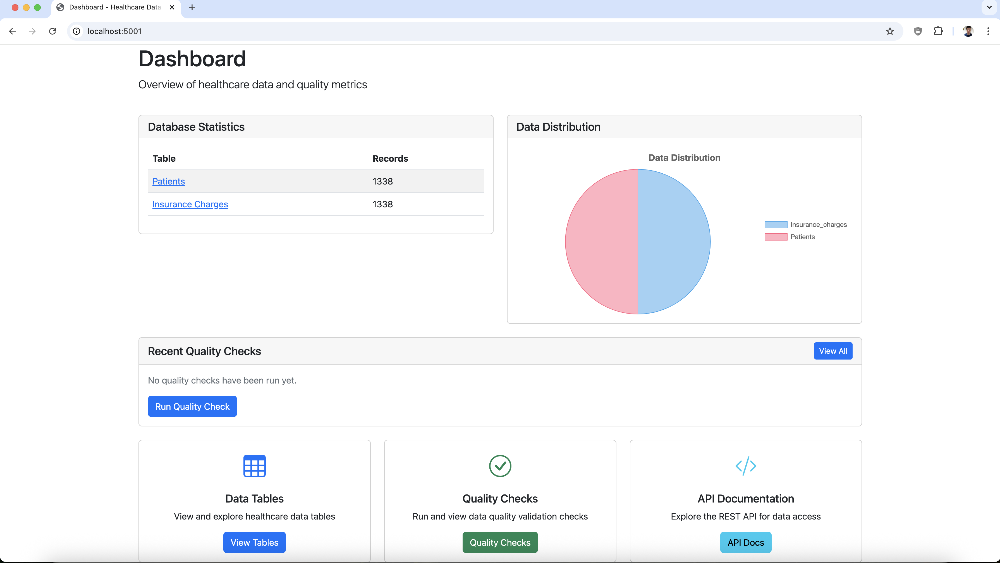

# Healthcare Data QA Platform

A web-based platform for healthcare data quality analysis and validation.

## Features

### Data Quality Checks
- Null value detection across all fields
- Value range validation for numeric fields
- Data consistency checks between related tables
- Real-time quality check execution
- Detailed results view with issue tracking

### Data Visualization
- Overview dashboard with key metrics
- Patient statistics and demographics
- Regional distribution visualization
- Insurance charges analysis
- Interactive data tables

### Database Tables
- Patients: Demographics and health metrics
  * Age, sex, BMI, children count
  * Smoking status
  * Regional distribution
- Insurance Charges: Financial data
  * Individual charges
  * Timestamp tracking
  * Patient relationship mapping

## Setup

1. Clone the repository:
```bash
git clone https://github.com/yourusername/healthcare-data-qa.git
cd healthcare-data-qa
```

2. Create and activate a virtual environment:
```bash
python3 -m venv venv
source venv/bin/activate  # On Windows: venv\Scripts\activate
```

3. Install dependencies:
```bash
pip3 install -r requirements.txt
```

4. Set up environment variables:
```bash
cp .env.example .env
# Edit .env with your configuration
```

5. Download the dataset:
```bash
python3 scripts/download_dataset.py
```

6. Initialize the database:
```bash
python3 scripts/init_db.py
```

7. Run the application:
```bash
python3 src/web/app.py
```

The application will be available at http://localhost:5001

## Dashboard Interface



The dashboard provides an overview of healthcare data and quality metrics:
- Database statistics showing record counts for patients and insurance data
- Data distribution visualization with interactive charts
- Recent quality check results and execution options
- Quick access to data tables, quality checks, and API documentation

## Project Structure

### Directory Layout
```
healthcare-data-qa/
├── data/                    # Data storage
│   ├── db/                 # SQLite database
│   └── quality_results/    # Quality check results
├── docs/                   # Documentation
├── scripts/                # Utility scripts for setup and maintenance
├── src/                    # Source code
│   ├── data_quality/      # Quality check modules
│   ├── web/               # Web application
│   │   ├── static/        # Static assets
│   │   └── templates/     # HTML templates
│   └── ml/                # Machine learning modules
└── tests/                 # Test suite
```

### Component Documentation
Each major component has detailed documentation:

#### [Utility Scripts](scripts/README.md)
- Dataset download and setup
- Database initialization
- Environment configuration

#### [Data Quality Modules](src/data_quality/README.md)
- Data validation and quality checks
- Schema validation
- Anomaly detection
- Statistical analysis

#### [Web Application](src/web/README.md)
- Flask web application
- Interactive dashboard
- Quality check interface
- API documentation

#### [Machine Learning Components](src/ml/README.md)
- Healthcare data validation
- Model performance validation
- Text analysis
- Feature importance analysis

#### [Testing Framework](tests/README.md)
- Automated test suites
- Integration tests
- UI automation
- API testing

## Quality Checks

The platform performs several types of data quality checks:

1. Null Value Check
   - Detects missing values in all columns
   - Reports count and location of null values

2. Value Range Check
   - Validates numeric fields against expected ranges
   - Age: 0-120 years
   - BMI: 10-60
   - Children: 0-10
   - Charges: $0-100,000

3. Data Consistency Check
   - Verifies relationships between tables
   - Checks for orphaned records
   - Validates referential integrity

## Documentation

### API Documentation
The platform provides a REST API for programmatic access to data quality functions. See `/api-docs` for detailed documentation.

### Testing Documentation
- [Testing Framework Documentation](tests/README.md) - Comprehensive guide for the test automation framework
- [Detailed Test Cases](docs/testing.md) - Detailed test cases and validation criteria
- [Architecture Documentation](docs/architecture.md) - System architecture and component interactions

## Contributing

1. Fork the repository
2. Create a feature branch
3. Make your changes
4. Run tests: `python3 -m pytest`
5. Submit a pull request

## License

This project is licensed under the MIT License - see the LICENSE file for details.

