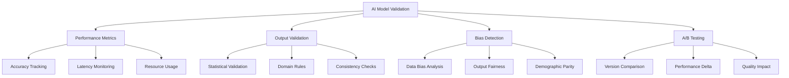
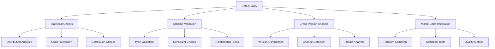
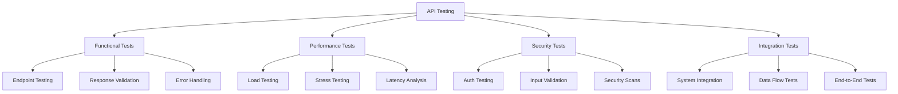
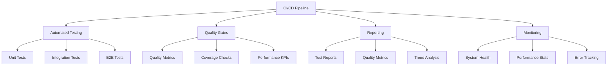
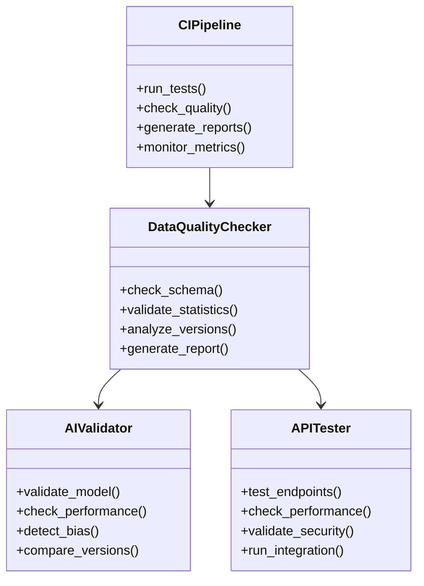

# Healthcare Data QA Automation Framework - Architecture & Implementation Plan

## Overview

This document outlines the architecture and implementation plan for enhancing the Healthcare Data QA Automation Framework to meet Komodo Health's requirements for MapAI validation and data quality automation.

## Current Architecture

The existing framework provides:
- Data quality validation for healthcare datasets
- Statistical anomaly detection
- Basic ML infrastructure for text analysis
- API endpoints for data access and quality checks
- Web dashboard for visualization

## Enhancement Plan

### 1. AI Model Validation Framework

#### Implementation Details:
- Model performance tracking system
- Automated validation pipelines
- Bias detection algorithms
- A/B testing infrastructure
- Version control for models

### 2. Enhanced Data Quality Framework

#### Implementation Details:
- Enhanced statistical validation
- Healthcare-specific data rules
- Cross-version comparison tools
- Monte Carlo integration
- Automated reporting

### 3. API Testing Infrastructure

#### Implementation Details:
- Comprehensive API test suite
- Performance testing framework
- Security validation tools
- Integration test automation

### 4. CI/CD Pipeline Integration

#### Implementation Details:
- Automated test execution
- Quality gate implementation
- Reporting system
- Monitoring infrastructure

## Technical Architecture

## Implementation Phases

### Phase 1: Foundation (Months 1-3)
- Set up enhanced data quality framework
- Implement basic AI model validation
- Create initial API testing suite
- Configure CI/CD pipeline

### Phase 2: Core Features (Months 4-6)
- Develop comprehensive model validation
- Implement advanced statistical checks
- Enhance API testing capabilities
- Add quality gates and reporting

### Phase 3: Advanced Features (Months 7-9)
- Add bias detection and fairness metrics
- Implement cross-version analysis
- Enhance security testing
- Improve monitoring and alerting

### Phase 4: Optimization (Months 10-12)
- Optimize performance and scalability
- Enhance reporting and visualization
- Implement advanced analytics
- Add predictive quality metrics

## Success Metrics

1. Data Quality
- Schema validation success rate > 99%
- Data completeness score > 95%
- Anomaly detection accuracy > 90%

2. AI Model Quality
- Model performance deviation < 5%
- Bias detection accuracy > 90%
- A/B testing confidence > 95%

3. API Quality
- API test coverage > 90%
- Performance SLA compliance > 99%
- Security vulnerability detection > 95%

4. System Performance
- Pipeline execution time < 30 minutes
- Resource utilization < 80%
- Error rate < 1%

## Next Steps

1. Review and approve architecture
2. Set up development environment
3. Begin Phase 1 implementation
4. Establish monitoring and reporting
5. Regular review and adjustment